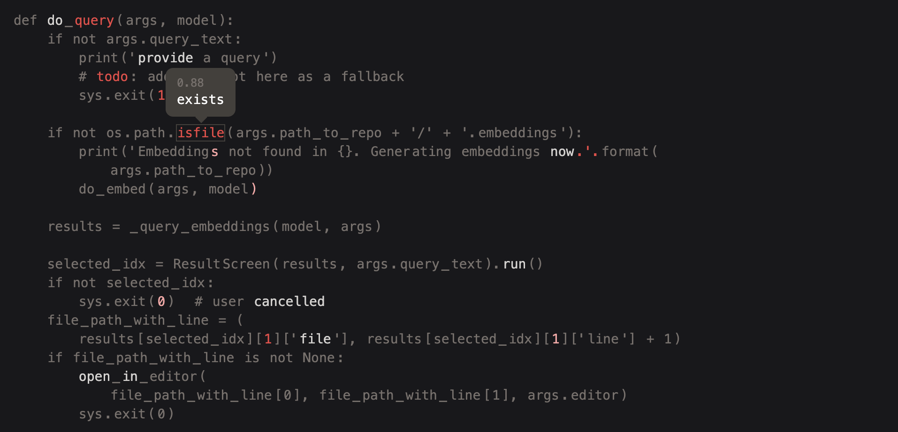

# Suspicious

<p align="center">
  
</p

<p align='center'>
    Sniffs possibly suspicious stuff in your source code. 100% local, no data leaves your computer.
</p>
<p align='center'>
    <a href="https://github.com/sturdy-dev/suspicious/blob/main/LICENSE.txt">
        
    </a>
    <a href="https://pypi.org/project/suspicious">
     
    </a>
</p>
<p align="center">
  <a href="#wtf-is-this">🤔 WTF is this</a> •
  <a href="#demo">🪄 Demos</a> •
  <a href="#installation">🔧 Installation</a> •
  <a href="#usage">💻 Usage</a> •
  <a href="#how-does-it-work">🧠 How it works</a>
</p>

-------------------------------------------------------------------

## WTF is this?

This is a CLI application that analyzes a source code file using an AI model. It then shows you parts that look suspicious to it.

It does **not** use rules or static analysis the way a linter tool would. Instead, the model generates its own code suggestions based on the surrounding context. Check out [how it works](#how-does-it-work).

> NB: All processing is done on your hardware and no data is transmitted to the Internet

Example output:



## Demo

Here's the output of running the application on its own source files (so meta).

- `cli.py` — [source code](./src/suspicious/cli.py) → [generated output](https://sturdy-dev.github.io/suspicious/demos/cli_py/)
- `render.py` — [source code](./src/suspicious/render.py) → [generated output](https://sturdy-dev.github.io/suspicious/demos/render_py/)
- `sus.py` — [source code](./src/suspicious/sus.py) → [generated output](https://sturdy-dev.github.io/suspicious/demos/sus_py/)

## Have I seen this before?

There was this post [AI found a bug in my code](https://news.ycombinator.com/item?id=33632610) on Hacker News which was pretty cool. I wanted to try it on my own code, so I went ahead and built my implementation of the idea.

## Installation

You can install `sus` via `pip` or from the source.

### Pip (MacOS, Linux, Windows)

```bash
pip3 install suspicious
```

### From source

```bash
git clone git@github.com:sturdy-dev/suspicious.git
cd suspicious
python -m pip install .
```

## Usage

You can run the program like this:

```bash
sus /path/to/file.py
```

This will generate and open an `.html` file with the results.

- `grey` means prediction is the same as the original
- `light grey` means the model had a different prediction but with super low confidence
- `light red` means things are looking a little sus
- `red` means there was a different prediction and confidence was higher

### Practical usage

Unclear. You run `sus` on a file and skim over the red stuff, maybe it spots something you missed. Ping me on [twitter](https://twitter.com/krlvi) if you catch something cool with it.

## How does it work?

In a nutshell, it feeds a tokenized representation of your source text into a Transformer model and asks the model to predict one token at a time using [Masked Language Modelling](https://huggingface.co/docs/transformers/tasks/language_modeling#masked-language-modeling).

For a general overview about Transformer models, check out [The Illustrated Transformer](https://jalammar.github.io/illustrated-transformer/) article by Jay Alammar, which helped me out in understanding the core ideas.

`sus` uses a model called [UniXcoder](https://github.com/microsoft/CodeBERT/tree/master/UniXcoder) which has been trained on the [CodeSearchNet](https://huggingface.co/datasets/code_search_net) dataset. To do the MLM (masked language modelling) we are adding a `lm_head` layer.

When `sus` processes your code, it first tokenizes the text, where a token could be a special character or programming language keyword, English word or part of a word.

Before feeding the sequence of token ids to the model, one or multiple tokens are replaced with a special `<mask>` token. After feeding the input through the network, we extract just the value at the masked location. This masking is done in a loop for each token to generate individual predictions.

Since this process is impractically slow, instead of masking one token at a time, `sus` masks 10% of the tokens, making sure that the masked locations are spread out (so that there is sufficient context around each prediction site).

The output of this entire process is a list of structs that contain the original and predicted values for each token. Example:

```json5
{
    "idx": 0, // position in sequence
    "original": "foo", // as originally written in the source file
    "predicted": "bar", // what the model predicted
    "cosine_similarity": 0.23, // how different the prediction is from the original in the vector space
    "probability": 0.92, // how confident the model is in it's prediction
}
```

This is then fed into an `html` template to be rendered for the user. Easy-peasy.

### Model

`sus` uses the decoder of [UniXcoder](https://github.com/microsoft/CodeBERT/tree/master/UniXcoder), specifically the [unixcoder-base-nine](https://huggingface.co/microsoft/unixcoder-base-nine) checkpoint. What's cool is that it's only 500 MB and ~120M parameters, which means it's quick to download and fast enough to run locally.

Larger models produce higher quality outputs, but you need to run the inference on a server.

## Supported languages

You can try `sus` on any source file, but you can expect best results with the following languages:

- java
- ruby
- python
- php
- javascript
- go
- c
- c++
- c#

## Bugs and limitations

- Accuracy — `sus` is meant to be executed locally (aka not sending code to a server), which puts some constraints on the AI model size. Larger models will produce higher quality results, but they can be tens of GB in size and without a beefy GPU could take a long time to generate the output. Because of this, `sus` uses a [modestly sized model](#model).
- Large files — The [model](#model) also puts constraints on the input size (analyzed file size). `sus` works around this by batching the input, but as a result of this, batches are not aware of the 'context' / code that is in other batches. Files are split in batches of 2500 characters which is super crude and is meant to correspond to ~1024 tokens.
- [Masking](#how-does-it-work) is done on per token basis. It could be interesting to first generate syntax tree from the code and then mask the entire node instead.

## License

Semantic Code Search is distributed under [AGPL-3.0-only](LICENSE.txt). For Apache-2.0 exceptions — <kiril@codeball.ai>
